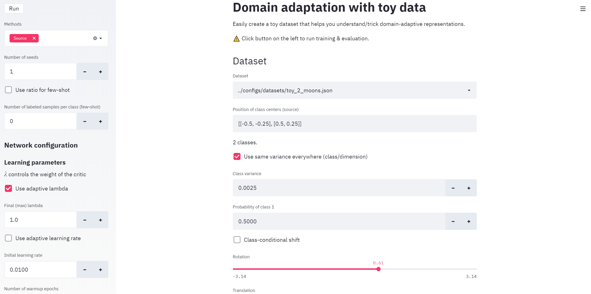

Quick start
-----------

Take your favorite OS, terminal, environment and run:

::

         git clone https://github.com/criteo-research/pytorch-ada.git

First you need to install the library. It has been tested with python
3.6+, with the latest versions of pytorch-lightning.

If you want to create a new conda environment, run:

::

        conda env create -n adaenv python=3.7
        conda activate adaenv

Install the library (with developer mode if you want to develop your own
models later on, otherwise you can skip the ``-e``):

::

        pip install -e adalib

*Note*: on **Windows**, it could be necessary to first install pytorch
and torchvision with conda:

::

        conda install -c pytorch pytorch
        conda install -c pytorch torchvision
        pip install -e adalib

Run on of the scripts:

::

        cd scripts
        python run_simple.py

By default, this script launches experiments with all kinds of methods
on a blobs dataset -- it doesn't take any parameter, you can change it
easily from the script. It may take a few minutes to finish.

Most parameters are available and can be changed through configuration
files, which are all grouped in the ``configs`` folder: 

  - datasets 
  - network layers and training parameters 
  - methods (Source, DANN, CDAN…), and their specific parameters.

Advanced options
----------------

The script ``run_full_options.py`` runs the same kind of experiments
allowing for more variants (semi-supervised, unbalanced, with gpus and
MLFlow logging). You can run it without parameters or with ``-h`` to get
help.

MLFlow
~~~~~~

You can log results to MLFlow. Start a MLFlow server in another
terminal:

::

        conda activate adaenv
        mlflow ui --port=31014

Streamlit application
~~~~~~~~~~~~~~~~~~~~~

Optionally, you can use the ``streamlit`` app. First install
``streamlit`` with

::

        pip install streamlit

then launch the app like this:

::

        streamlit run run_toys_app.py

This will start a web app with a default port = 8501. It should look like this in your browser:

